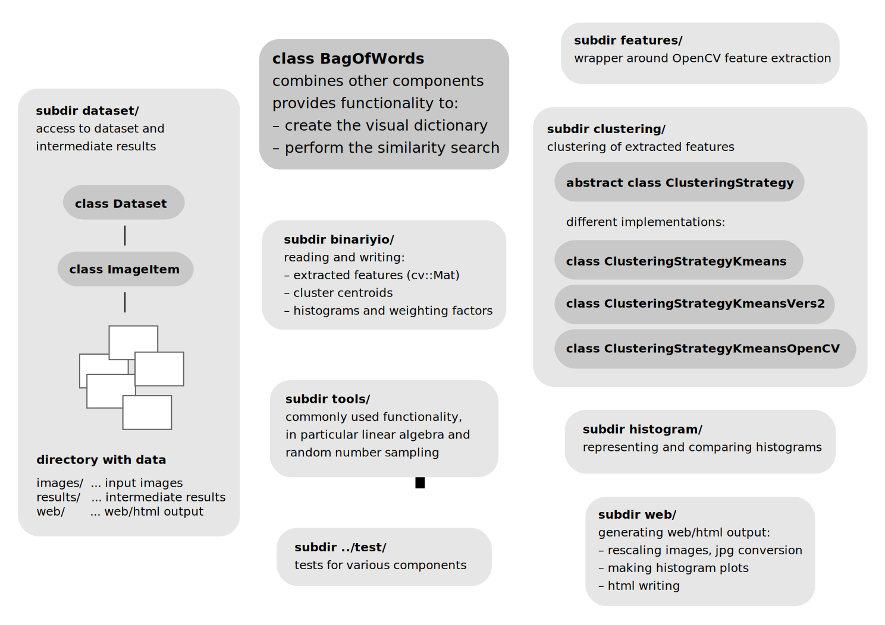

### Introduction

This repository contains the final project for the course 'Modern C++ for Computer Vision and Image Processing' by Peeyush Kumar and Jan Quakernack (summer term 2019). It is an implementation of a bag of visual words approach for finding similar images in an image dataset. The code is based on an inital setup by Ignacio Vizzo.

The code was tested on Ubuntu 18.04.3 using the GCC compiler version 7.4.0 and CMake version 3.10.2. It conforms the C++14 standard.

### Prerequisites

#### OpenCV

The SIFT implementation is required. It is provided in OpenCV's extra modules, see [here](https://github.com/opencv/opencv_contrib). Testing was done with OpenCV version 3.2.0.

#### Boost

Boost is used for filesystem support and parsing of terminal arguments. Please make sure it is available, see [here](https://www.boost.org/). Testing was done with Boost version 1.65.1.

#### Eigen

Eigen3 is required for one variant of K-Means we provide. Please make sure it is available, see [here](http://eigen.tuxfamily.org/index.php?title=Main_Page). Testing was done with Eigen version 3.3.4.

#### Benchmark

Google benchmark is used to benchmark some parts of the code. To install it, please follow the instructions [here](https://github.com/google/benchmark). However, this is optional and CMake will check the availability of benchmark.

### Build

CMake files for building the code are provided. For a clean build, run the following commands from the project's root directory:

```
rm -r build
mkdir build && cd build
cmake ..
make
```

Alternative to speed up the build process:
```
make -j <number of cpu cores>
```

Binaries are written to `results/bin/`.

### Test

A test binary is written to `results/bin/cpp_final_project_test`. Running it will perform automated tests of some components using gtest. Please make sure an empty directory `results/tests_output/` exists. If the environment variable `CPP_FINAL_PROJECT_DATA_DIR` is not set properly (see below) some tests are expected to fail.

Corresponding source files for all tests can be found under`tests/`.

### Run

The location of the dataset is expected to be defined by setting an environment variable named `CPP_FINAL_PROJECT_DATA_DIR`. Please run
```
export CPP_FINAL_PROJECT_DATA_DIR=<full-path-to-the-dataset-root-dir>
```
inside a terminal or consider adding this line to your `.bashrc`. Images in `.png` format are expected to be located under `<dataset-root-dir>/images/`. Further ouput will be added under the root directory. The final file structure is outlined below.

#### Alternative 1

Each of the following programs should support a `-h` option. Note the following programs must be executed in order:

##### 1. Extract feature descriptors for each image

Run `results/bin/extract_features`.

##### 2. Cluster features

Run `results/bin/compute_cluster_centroids`. Note that this is by far the computationally most demanding part. Runtime on the Freiburg dataset with `--num-clusters 1000` and `--iterations 25` is about 2 hours on our machine.

##### 3. Compute a histogram representation for each image

Run `results/bin/make_histograms`.

##### 4. Determine similarities using cosine measure and generate web/html output

Run `results/bin/make_web_output`. The generated output is written to `<dataset-root-dir>/web/`.

The file structure should now look like this:

```
<dataset-root-dir>/
    |_ images/
    |    |_ <images in .png format>
    |
    |_ results/
    |    |_ centroids.binary
    |    |_ histogram_weights.binary
    |    |_ <one binary file with extracted features for each image>
    |
    |_ web/
         |_ images/
         |    |_ <rescaled images and histogram plots in .jpg format>
         |
         |_ index.html
         |_ style.css
```

#### Alternative 2

An alternative is provided, which combines the first three steps into a single executable.

##### 1. Create the visual dictionary in one step

Run `results/bin/create_dictionary_vers_2`.

##### 2. Find images most similar to a query image

Run `results/bin/search_image_vers_2 <path-to-query-image>`. A `bag_of_words_output.html` should appear in the current directory.

### Further details

#### Alternative implementations

Please note that we provide alternative implementations for some part of our code to make the contribution of each team member more transparent. This applies to two cases:

1. There are two different own implementations of K-Means clustering, which can be found under `src/clustering/`. The second version differs from first one by using a more sophisticated initialization method. Additionally, we provide a wrapper around the OpenCV implementation. All variants have a common interface and the code runs interchangeably with all of them. All can be compared using the benchmark code `results/bin/cpp_final_project_benchmark`.

2. There are two different implementations of the bag of words class, which basically wraps around all other components. Consequently, also the main executables show slight differences as already pointed out above. The second version also reimplements some of the lower level functionality such as comparing histograms.

In general the team member who mainly contributed to a specific file in mentioned as the author in the file header.

#### Code structure



### Results

Some of our results are uploaded [here](https://uni-bonn.sciebo.de/s/KouYE2c1V5dKcOE) and can be found in the `web/` subdirectory. Note that due to the large file size, we do not provide intemediate results for the Freiburg dataset. We also upload results on two datasets consisting of 25 and 1000 images generated from the [COIL-100 dataset](http://www.cs.columbia.edu/CAVE/software/softlib/coil-100.php). The results were generated using the following parameters regarding the clustering step:

* `Freiburg`
  * variant: `kmeans`
  * num-clusters: 1000
  * iterations: 25 (no convergence)
  * epsilon: 0.001

* `Test-1000`
  * variant: `kmeans`
  * num-clusters: 100
  * iterations: 100 (no convergence)
  * epsilon: 0.001

* `Test-25`
  * variant: `kmeans`
  * num-clusters: 100
  * iterations: 25
  * epsilon: 0.001

